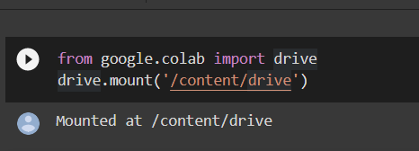

# Fire department call for service data analysis using apache spark and pyspark
## Dataset Link: [https://data.sfgov.org/Public-Safety/Fire-Department-Calls-for-Service/nuek-vuh3](https://data.sfgov.org/Public-Safety/Fire-Department-Calls-for-Service/nuek-vuh3)
## Colab Notebook Link: [https://drive.google.com/drive/folders/1CDUW0W5-oNmBvlhtOE2AWtFs5LmKeMBD](https://drive.google.com/drive/folders/1CDUW0W5-oNmBvlhtOE2AWtFs5LmKeMBD)

## Procedure:
- Connecting Colab to google drive\

- Setting up PySpark
    - Download Java\
    
    - installing Apache Spark 3.0.0 with Hadoop 3.2\
    
    - Setting up the environment path in colab to run pyspark \
    
    - Locate Spark on the system and importing it as a regular library\
    
    - Now, we can import SparkSession from pyspark.sql and create a SparkSession, which is the entry point to Spark.
    
- Loading and analyzing the dataset

## Analysis
- How many different calls you made to the fire department
- How many different unique Call Final Disposition you made to the fire department
- How many incidents of each call types were there
- How many distinct years of data in this data
- How many service calls were logged in the past 7 days

## RDD Partitions 
- Converting the Dataset into RDD partitions: 17 partitions were formed